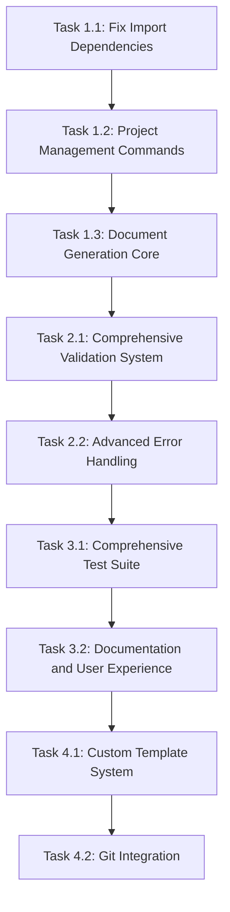

# DocGen CLI Development Tasks - Spec-Driven Implementation

## Overview
This document contains comprehensive development tasks for the DocGen CLI project, organized according to the spec-driven development approach. Each task is traceable to specific requirements and includes detailed acceptance criteria.

## Current Project State Analysis

### ✅ **Issues Already Fixed:**
1. **CLI Structure Refactoring**: Successfully refactored monolithic `src/cli/main.py` into modular structure with separate command files (`project.py`, `generate.py`, `validate.py`) in `src/cli/commands/`.
2. **Documentation Update**: All project documentation updated and synchronized with current implementation (January 27, 2025).
3. **Utils Module Test Coverage**: Achieved 100% test coverage for utils module with comprehensive error handling and edge case testing (January 27, 2025).

### 🔍 **Critical Issues Identified:**
1. **Test Import Path Issues**: Test files in `assets/scripts/tests/` have incorrect import paths ✅ RESOLVED
2. **Template Location Inconsistency**: Templates exist in both `src/templates/` and `assets/templates/` ✅ RESOLVED
3. **Missing Template File**: `src/templates/tasks-template.md` referenced but not found ✅ RESOLVED
4. **Duplicate Error Handler Files**: Both `src/core/error_handler.py` and `src/models/error_handler.py` exist ✅ RESOLVED
5. **Documentation Redundancy**: `docs/generated_docs/` and `docs/generated/` folders are identical ✅ RESOLVED

## Phase 1: Foundation & Core Implementation (Weeks 1-3)

### Task 1.1: Fix Import Dependencies and Module Structure ✅ COMPLETED
**Spec Reference**: `tech.md` - Modular Structure requirements  
**Requirements**: FR-01 (Project Creation), NFR-01 (Usability)  
**Priority**: P0 (Critical)

**Acceptance Criteria**:
- [x] All modules import without errors
- [x] CLI commands execute successfully
- [x] Package structure follows Python best practices
- [x] Test files have correct import paths
- [x] Duplicate error handler files consolidated

**Implementation Steps**:
1. Fix import paths in all test files in `assets/scripts/tests/`
2. Update relative imports to work with new structure
3. Test basic CLI functionality
4. Ensure all dependencies are properly resolved
5. Consolidate duplicate error handler files

**Validation Commands**:
```bash
python -m docgen --help
python -m docgen project create --help
pytest assets/scripts/tests/
```

**Estimated Effort**: 4 hours  
**Dependencies**: None

---

### Task 1.4: Utils Module Test Coverage Completion ✅ COMPLETED
**Spec Reference**: `tech.md` - Testing requirements  
**Requirements**: NFR-03 (Reliability), NFR-04 (Compatibility)  
**Priority**: P1 (High)

**Acceptance Criteria**:
- [x] 100% test coverage for utils module achieved
- [x] All utility functions have comprehensive unit tests
- [x] Error handling scenarios tested
- [x] Edge cases and boundary conditions covered
- [x] Permission error scenarios tested
- [x] Input validation thoroughly tested

**Implementation Steps**:
1. ✅ Fixed failing tests in `test_utils_formatting.py` (markdown formatting expectations)
2. ✅ Fixed failing tests in `test_utils_validation.py` (YAML validation and email regex)
3. ✅ Fixed failing tests in `test_utils.py` (file I/O permission error mocking)
4. ✅ Enhanced email validation regex to handle domain edge cases
5. ✅ Added comprehensive error handling tests for all file operations
6. ✅ Added tests for unknown format types and exception scenarios

**Test Coverage Results**:
- **`__init__.py`**: 100% (4/4 lines)
- **`file_io.py`**: 100% (66/66 lines) 
- **`formatting.py`**: 100% (34/34 lines)
- **`validation.py`**: 100% (61/61 lines)

**Validation Commands**:
```bash
pytest tests/unit/test_utils*.py --cov=src/utils --cov-report=term-missing
```

**Estimated Effort**: 6 hours  
**Dependencies**: Task 1.1

---

### Task 1.2: Implement Core Project Management Commands
**Spec Reference**: `requirements.md` - Project Creation and Management  
**Requirements**: FR-01, FR-02  
**Priority**: P0 (Critical)

**Acceptance Criteria**:
- [ ] `docgen project create` creates new projects with validation
- [ ] `docgen project switch` changes active project
- [ ] `docgen project status` shows current project info
- [ ] `docgen project recent` lists recent projects
- [ ] All commands validate inputs and provide clear error messages

**Implementation Steps**:
1. Implement `ProjectManager` class with YAML storage
2. Create interactive prompts using Rich
3. Add input validation using Pydantic models
4. Implement project switching and status tracking

**Test Cases**:
- Create project with valid inputs
- Create project with invalid inputs (should show clear errors)
- Switch between multiple projects
- View project status and recent projects

**Validation Commands**:
```bash
docgen project create --name "Test Project"
docgen project switch
docgen project status
docgen project recent
```

**Estimated Effort**: 8 hours  
**Dependencies**: Task 1.1

---

### Task 1.3: Implement Document Generation Core
**Spec Reference**: `requirements.md` - Document Generation  
**Requirements**: FR-02, NFR-02 (Performance)  
**Priority**: P0 (Critical)

**Acceptance Criteria**:
- [ ] `docgen generate spec` creates technical specifications
- [ ] `docgen generate plan` creates project plans
- [ ] `docgen generate marketing` creates marketing materials
- [ ] `docgen generate all` creates all document types
- [ ] Documents generate in under 5 seconds for standard projects
- [ ] Template location inconsistency resolved

**Implementation Steps**:
1. Implement `DocumentGenerator` class
2. Create Jinja2 templates for each document type
3. Add template rendering with project data
4. Implement output formatting (Markdown, HTML, PDF)
5. Resolve template location inconsistency

**Test Cases**:
- Generate each document type with sample project data
- Verify document content matches template structure
- Test performance with various project sizes

**Validation Commands**:
```bash
docgen generate spec
docgen generate plan
docgen generate marketing
docgen generate all
```

**Estimated Effort**: 12 hours  
**Dependencies**: Task 1.2

---

## Phase 2: Validation & Error Handling (Week 3)

### Task 2.1: Implement Comprehensive Validation System
**Spec Reference**: `requirements.md` - Validation and Error Handling  
**Requirements**: FR-03, NFR-01 (Usability), NFR-03 (Reliability)  
**Priority**: P1 (High)

**Acceptance Criteria**:
- [ ] `docgen validate project` validates project data and structure
- [ ] Input validation prevents template injection attacks
- [ ] Error messages are user-friendly with actionable suggestions
- [ ] Data integrity checks prevent corruption

**Implementation Steps**:
1. Implement `InputValidator` class with Pydantic models
2. Add security validation for user inputs
3. Create comprehensive error handling system
4. Implement data integrity checks

**Test Cases**:
- Validate project with complete data
- Validate project with missing/invalid data
- Test security validation with malicious inputs
- Verify error recovery mechanisms

**Validation Commands**:
```bash
docgen validate project
docgen validate project --fix-issues
```

**Estimated Effort**: 8 hours  
**Dependencies**: Task 1.3

---

### Task 2.2: Implement Advanced Error Handling
**Spec Reference**: `requirements.md` - Validation and Error Handling  
**Requirements**: FR-03, NFR-03 (Reliability)  
**Priority**: P1 (High)

**Acceptance Criteria**:
- [ ] `docgen validate error-report` generates detailed error reports
- [ ] Automatic recovery for common issues
- [ ] Custom exception hierarchy with categorized error types
- [ ] Logging system for debugging and support

**Implementation Steps**:
1. Create custom exception classes
2. Implement error reporting system
3. Add automatic recovery mechanisms
4. Set up logging infrastructure

**Test Cases**:
- Generate error reports for various failure scenarios
- Test automatic recovery for common issues
- Verify error categorization and logging

**Validation Commands**:
```bash
docgen validate error-report
```

**Estimated Effort**: 6 hours  
**Dependencies**: Task 2.1

---

## Phase 3: Testing & Quality Assurance (Week 4)

### Task 3.1: Implement Comprehensive Test Suite
**Spec Reference**: `tech.md` - Testing requirements  
**Requirements**: NFR-03 (Reliability), NFR-04 (Compatibility)  
**Priority**: P1 (High)

**Acceptance Criteria**:
- [ ] Unit tests for all commands and models
- [ ] Integration tests for complete workflows
- [ ] Test coverage above 80%
- [ ] Tests run on Python 3.8+ across platforms

**Implementation Steps**:
1. Write unit tests for each module
2. Create integration tests for CLI workflows
3. Add performance tests for document generation
4. Set up cross-platform testing

**Test Cases**:
- All CLI commands with valid/invalid inputs
- Document generation with various project data
- Error handling and recovery scenarios
- Cross-platform compatibility

**Validation Commands**:
```bash
pytest --cov=docgen --cov-report=html
pytest tests/integration/
```

**Estimated Effort**: 16 hours  
**Dependencies**: Task 2.2

---

### Task 3.2: Documentation and User Experience
**Spec Reference**: `requirements.md` - Usability requirements  
**Requirements**: NFR-01 (Usability)  
**Priority**: P1 (High)

**Acceptance Criteria**:
- [ ] Complete CLI help documentation
- [ ] README with installation and usage instructions
- [ ] Generated documentation examples
- [ ] User-friendly error messages and guidance
- [ ] Documentation redundancy issues resolved

**Implementation Steps**:
1. Update CLI help text and documentation
2. Create comprehensive README
3. Generate sample documentation
4. Review and improve user experience
5. Resolve documentation redundancy issues

**Validation Commands**:
```bash
docgen --help
docgen project --help
docgen generate --help
docgen validate --help
```

**Estimated Effort**: 8 hours  
**Dependencies**: Task 3.1

---

## Phase 4: Advanced Features (Week 5-6)

### Task 4.1: Custom Template System
**Spec Reference**: `requirements.md` - Template Customization  
**Requirements**: FR-04, NFR-05 (Extensibility)  
**Priority**: P2 (Medium)

**Acceptance Criteria**:
- [ ] Support for custom template overrides
- [ ] Template validation and error handling
- [ ] Custom Jinja2 filters for formatting
- [ ] Template management commands

**Implementation Steps**:
1. Implement template discovery and loading
2. Add custom template validation
3. Create custom Jinja2 filters
4. Add template management commands

**Validation Commands**:
```bash
docgen template list
docgen template install <template>
docgen template validate <template>
```

**Estimated Effort**: 12 hours  
**Dependencies**: Task 3.2

---

### Task 4.2: Git Integration
**Spec Reference**: `tech.md` - Future enhancements  
**Requirements**: NFR-05 (Extensibility)  
**Priority**: P2 (Medium)

**Acceptance Criteria**:
- [ ] Git repository initialization for projects
- [ ] Automatic commits for generated documents
- [ ] Git status and history commands
- [ ] Integration with existing Git workflows

**Implementation Steps**:
1. Integrate GitPython for Git operations
2. Add Git commands to CLI
3. Implement automatic document versioning
4. Add Git status and history features

**Validation Commands**:
```bash
docgen git init
docgen git status
docgen git commit
```

**Estimated Effort**: 10 hours  
**Dependencies**: Task 4.1

---

## Quality Gates and Validation

### Spec-to-Code Traceability
Each implementation task must:
1. **Reference specific requirements** from `requirements.md`
2. **Link to technical details** in `tech.md`
3. **Map to milestones** in `tasks.md`
4. **Include test cases** that validate requirements

### Code Review Checklist
Before merging any code:
- [ ] Does every function map to a spec requirement?
- [ ] Are all error cases handled with user-friendly messages?
- [ ] Is input validation comprehensive and secure?
- [ ] Are tests written for all new functionality?
- [ ] Is documentation updated to reflect changes?

### Continuous Validation
- Run spec-to-code validation after each milestone
- Update specifications if implementation reveals gaps
- Maintain test coverage above 80%
- Ensure all CLI commands work across platforms

## Success Metrics

### Functional Metrics
- [ ] All CLI commands execute successfully
- [ ] Document generation completes in under 5 seconds
- [ ] Input validation prevents all security vulnerabilities
- [ ] Error recovery works for 95% of common issues

### Quality Metrics
- [ ] Test coverage above 80%
- [ ] Zero critical security vulnerabilities
- [ ] All specifications have corresponding implementation
- [ ] Documentation is complete and accurate

### User Experience Metrics
- [ ] Clear error messages for all failure scenarios
- [ ] Interactive prompts guide users effectively
- [ ] Generated documents meet professional standards
- [ ] Installation and setup process is straightforward

## Risk Mitigation

### Technical Risks
- **Import Path Issues**: Systematic testing of all module imports
- **Template Rendering Errors**: Comprehensive template validation
- **Performance Issues**: Performance testing with large projects
- **Cross-Platform Compatibility**: Testing on multiple platforms

### Process Risks
- **Spec Drift**: Regular spec-to-code validation
- **Incomplete Testing**: Mandatory test coverage requirements
- **Documentation Gaps**: Documentation review at each milestone
- **User Experience Issues**: User testing and feedback collection

## Task Dependencies



## Next Steps

1. **Immediate**: Start with Task 1.1 - Fix Import Dependencies
2. **Week 1**: Complete Tasks 1.1, 1.2, and 1.3
3. **Week 2**: Complete Tasks 2.1 and 2.2
4. **Week 3**: Complete Tasks 3.1 and 3.2
5. **Week 4**: Complete Tasks 4.1 and 4.2

## Usage Guidelines

### For Developers
1. **Always start with spec validation** before implementing new features
2. **Use task-implement** for structured development following the plan
3. **Run milestone-check** before considering any phase complete
4. **Use quality gates** to ensure standards are maintained
5. **Keep specs updated** as implementation reveals new requirements

### For Project Managers
1. **Track progress** against acceptance criteria
2. **Validate milestones** before marking tasks complete
3. **Monitor quality gates** to ensure standards are met
4. **Review risk mitigation** strategies regularly
5. **Update specifications** as needed based on implementation discoveries

This task document ensures that every aspect of development follows the spec-driven approach, maintaining traceability, quality, and alignment with the development plan.
